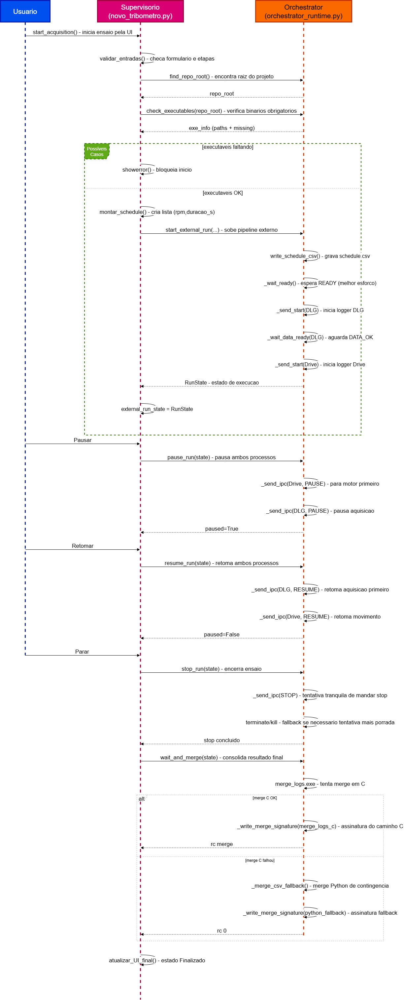

# Guia de Integracao: Supervisorio e Orchestrator Runtime

Arquivo principal desta documentacao:
- `Supervisório/orchestrator_runtime.py`

Arquivo que consome essa API:
- `Supervisório/novo_tribometro.py`

## Para que este documento existe

Este documento serve para orientar manutencao do supervisorio no modo externo (pipeline com executaveis C).
A ideia nao e explicar Python basico, e sim deixar claro como o sistema foi dividido, como os modulos se comunicam e o que pode quebrar quando alguem altera a integracao.

Quando abrir este documento:
- Quando for alterar `novo_tribometro.py` e precisar entender a fronteira com o orchestrator.
- Quando houver falha para iniciar, pausar, retomar, parar ou gerar o merge final.
- Quando for mudar caminhos de executaveis, formato de CSV ou protocolo IPC.

## Contexto geral do sistema

No projeto atual, o supervisorio nao conversa direto com hardware no fluxo principal. Ele delega essa parte para executaveis C:
- `dlg_logger_ipc.exe` (DLG)
- `a5_speed_logger.exe` (Drive)
- `merge_logs.exe` (merge final)

O `novo_tribometro.py` continua sendo o dono da experiencia de uso (UI, validacoes, estado visual, mensagens), mas o controle operacional do ensaio externo fica no `orchestrator_runtime.py`.

Essa divisao foi feita para manter a interface mais simples e reduzir risco de regressao quando mudar detalhes de processo, IPC e merge.

## Como supervisorio e orchestrator se comunicam

A comunicacao entre os dois e chamada de funcao Python (import de modulo), nao rede.

No `novo_tribometro.py`, as chamadas principais sao:
- `orch.find_repo_root()`
- `orch.check_executables(...)`
- `orch.rpm_from_mm_s(...)`
- `orch.start_external_run(...)`
- `orch.pause_run(...)`
- `orch.resume_run(...)`
- `orch.stop_run(...)`
- `orch.wait_and_merge(...)`

Em termos práticos:
- O supervisorio prepara parametros e chama o orchestrator.
- O orchestrator executa subprocessos, envia comandos IPC e devolve estado de execucao.
- O supervisorio usa esse estado para controlar botoes, labels e fluxo do ensaio.

## Tecnologia usada e por que

### 1) `subprocess` (Python)
Usado para iniciar os executaveis C e manter handles de processo.
Sem isso, o supervisorio nao conseguiria enviar `START/PAUSE/RESUME/STOP` para os loggers.

### 2) IPC por linha (`stdin/stdout`)
Comandos sao texto simples:
- `START`
- `PAUSE`
- `RESUME`
- `STOP`

Esse protocolo foi escolhido por simplicidade operacional e por ser facil de depurar em log.

### 3) CSV
Arquivos intermediarios e resultado final sao CSV:
- `schedule.csv`
- `dlg.csv`
- `drive.csv`
- `resultado_ensaio.csv`

CSV foi mantido para facilitar rastreabilidade, suporte e comparacao entre ensaios.

## Fluxo do ensaio (modo externo)

### Inicio
1. Supervisorio valida formulario e monta o cronograma.
2. Supervisorio converte mm/s para RPM com `rpm_from_mm_s`.
3. Supervisorio chama `start_external_run`.
4. Orchestrator grava `schedule.csv`.
5. Orchestrator encontra executaveis obrigatorios.
6. Orchestrator sobe DLG e Drive em `--ipc`.
7. Orchestrator aguarda `READY` (melhor esforco).
8. Orchestrator envia `START` no DLG.
9. Orchestrator espera `DATA_OK` do DLG.
10. Orchestrator envia `START` no Drive.
11. Orchestrator retorna `RunState` para o supervisorio.

A ordem DLG antes de Drive existe para reduzir risco de iniciar movimento sem aquisicao valida.

### Pausa e retomada
- `pause_run(state)` pausa Drive primeiro e DLG depois.
- `resume_run(state)` retoma DLG primeiro e Drive depois.

Essa ordem prioriza seguranca no pause e alinhamento temporal no resume.

### Parada
- `stop_run(state)` tenta parada graciosa via IPC (`STOP`).
- Se os processos nao fecharem no prazo, aplica `terminate()` e `kill()` como ultimo recurso.

### Fim e merge
- `wait_and_merge(state)` espera os dois processos terminarem.
- Tenta merge em C (`merge_logs.exe`).
- Se falhar ou nao gerar arquivo, usa fallback Python (`_merge_csv_fallback`).

## Assinatura de origem do merge

Para depuracao, o pipeline agora grava um arquivo auxiliar ao lado do resultado final:
- `<resultado_ensaio.csv>.merge_source.txt`

Conteudo esperado:
- `merge_source=merge_logs_c` quando merge em C foi usado.
- `merge_source=python_fallback` quando fallback Python foi usado.

Esse arquivo existe para eliminar ambiguidade durante testes e manutencao.

## Contratos que precisam ser preservados

### `schedule`
Formato esperado:
- tipo: `List[Tuple[int, float]]`
- conteudo: `(rpm, duracao_s)`

Se mudar esse formato, o logger do Drive pode deixar de interpretar etapas corretamente.

### `out_paths`
Chaves esperadas:
- `dlg_csv`
- `drive_csv`
- `merge_csv`
- `schedule_csv`

Se renomear chave sem atualizar orchestrator, o start externo quebra por `KeyError` ou caminho invalido.

### `RunState`
`RunState` e o contrato de estado entre supervisorio e orchestrator.
Ele guarda processos, caminhos e parametros da execucao.
Sem ele, nao ha como pausar/retomar/parar corretamente o ensaio externo.

## Catalogo de funcoes: o que faz e para que serve na pratica

A lista abaixo funciona como referencia de manutencao para quem mexe no supervisorio.

### `sanitize_folder_name(name)`
O que faz:
- Limpa nome de pasta para regras do Windows.

Para que serve na pratica:
- Evita erro de criacao de diretorio quando usuario digita caracteres invalidos no nome do ensaio.

### `build_output_paths(base_dir, nome_ensaio, estudo)`
O que faz:
- Cria pasta do ensaio e devolve caminhos padrao dos arquivos de saida.

Para que serve na pratica:
- Padroniza onde cada arquivo vai ser escrito, evitando variacao de estrutura entre maquinas.

### `write_schedule_csv(path, schedule)`
O que faz:
- Escreve o cronograma do Drive em CSV com colunas `rpm,duration_s`.

Para que serve na pratica:
- O logger do Drive consome esse arquivo para saber setpoints e duracoes.

### `rpm_from_mm_s(vel_mm_s, raio_mm, relacao=1.0)`
O que faz:
- Converte velocidade linear para RPM inteiro.

Para que serve na pratica:
- Garante que a UI possa trabalhar em mm/s enquanto o Drive recebe RPM.

Ponto de atencao:
- A funcao usa magnitude (`abs`), sem sinal negativo.

### `find_repo_root(start=None)`
O que faz:
- Tenta descobrir raiz do repositorio subindo diretorios.

Para que serve na pratica:
- Permite localizar executaveis mesmo quando app roda de caminhos diferentes.

### `check_executables(repo_root)`
O que faz:
- Verifica existencia de `dlg_logger_ipc.exe`, `a5_speed_logger.exe` e `merge_logs.exe`.

Para que serve na pratica:
- Evita iniciar ensaio sem binarios necessarios.
- Retorna lista `missing` para mensagem clara de erro.

### `find_calibra_ui_exe(repo_root="")`
O que faz:
- Localiza `CalibraDLG_UI.exe`.

Para que serve na pratica:
- Botao "Configurar canais" usa essa funcao para abrir a UI de calibracao sem hardcode fragil.

### `start_external_run(...)`
O que faz:
- Inicia de fato o pipeline externo (DLG + Drive) e devolve `RunState`.

Para que serve na pratica:
- E a porta principal do supervisorio para iniciar um ensaio externo.

Pontos de atencao:
- Depende do formato de `schedule`.
- Depende de `out_paths` completos.
- Sequencia DLG->DATA_OK->Drive e intencional e nao deve ser invertida sem analise.

### `wait_and_merge(state)`
O que faz:
- Espera processos encerrarem e gera `resultado_ensaio.csv`.

Para que serve na pratica:
- Garante consolidacao do ensaio no final.
- Ativa fallback Python quando merge C falhar.
- Escreve assinatura de origem do merge.

### `stop_run(state)`
O que faz:
- Envia `STOP` e tenta encerramento gracioso, com fallback forcado.

Para que serve na pratica:
- Encerrar ensaio com menor risco de truncar arquivos.

### `pause_run(state)`
O que faz:
- Envia `PAUSE` para Drive e DLG.

Para que serve na pratica:
- Congela o ensaio sem perder contexto de execucao.

### `resume_run(state)`
O que faz:
- Envia `RESUME` para DLG e Drive.

Para que serve na pratica:
- Retoma ensaio pausado mantendo alinhamento temporal do pipeline.

## Funcoes internas de apoio (usar so quando realmente necessario)

### `find_exe(candidates, fallback_name=None)`
Utilitario para encontrar executavel em lista de caminhos e, opcionalmente, no PATH.

### `_wait_ready(proc, tag, timeout_s=5.0)`
Le stdout ate encontrar `READY` (ou timeout).
Usado para reduzir risco de enviar comando cedo demais.

### `_send_start(proc)`
Atalho para `_send_ipc(proc, "START")`.

### `_send_ipc(proc, command)`
Escrita de comando IPC por linha no stdin do processo.
Retorna sucesso/falha de envio.

### `_wait_data_ready(proc, timeout_s=5.0)`
Aguarda `DATA_OK` ou `DATA_TIMEOUT` do DLG.

### `_merge_csv_fallback(dlg_csv, drive_csv, out_csv)`
Merge em Python para contingencia.
Mantem a mesma estrutura de colunas do resultado consolidado.

### `_write_merge_signature(out_csv, source)`
Grava arquivo auxiliar com origem do merge (`merge_logs_c` ou `python_fallback`).

## Guia rapido para edicao segura no supervisorio

1. Nao mude formato de `schedule` sem revisar logger do Drive.
2. Nao mude chaves de `out_paths` sem revisar orchestrator.
3. Nao remova `RunState` do fluxo de pause/resume/stop.
4. Nao altere ordem de start DLG->Drive sem validar impacto em sincronismo.
5. Se mudar schema de `dlg.csv` ou `drive.csv`, ajuste tambem `_merge_csv_fallback`.
6. Se mudar nomes/caminhos de executaveis, ajuste `check_executables`.

## Diagnostico rapido de problemas

### "Executaveis nao encontrados"
- Conferir build e pastas de saida.
- Conferir retorno de `check_executables`.

### Ensaio nao inicia
- Conferir se DLG emite `DATA_OK`.
- Conferir rede/porta do DLG e disponibilidade do equipamento.

### Merge ausente ou incompleto
- Verificar se `merge_source.txt` indica C ou fallback.
- Se fallback frequente, investigar por que merge em C falha no ambiente.

### Pause/Resume sem efeito
- Confirmar inicio com `--ipc`.
- Confirmar que `external_run_state` ainda aponta para processos vivos.

---

Este documento deve ser atualizado junto com qualquer mudanca de:
- protocolo IPC
- schema de CSV
- comportamento de start/stop/pause/resume
- localizacao/nome de executaveis

## Diagrama de sequencia (Supervisorio e Orchestrator)

